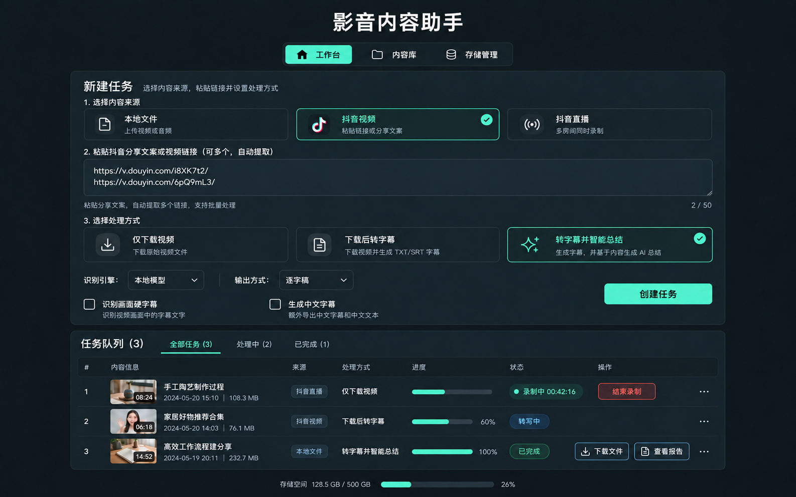

# 影音内容助手

**v3.1.0 · 视频下载、直播录制、字幕转写与智能总结**

影音内容助手将素材获取、语音转写、字幕处理和内容归纳整合在一个本地网页中。支持本地视频/音频、抖音短视频和抖音直播，可按需要只保存视频，也可继续生成字幕与总结报告。

产品名称为“影音内容助手”；Python 包名、命令行入口和项目目录仍沿用 `video2txt`。

## 界面预览



界面设计示意，实际任务数据与界面细节以运行版本为准。

## 功能概览

| 功能 | 当前支持 |
| --- | --- |
| 本地素材 | 批量上传视频、音频，可同时上传同名 SRT / ASS / SSA / VTT 字幕 |
| 抖音视频 | 单条、分享文案和账号主页批量下载；支持扫码登录、日期筛选、画质选择、多地址重试和跨批次去重，每批最多 50 个 |
| 抖音直播 | 每批最多 10 个链接，可同时录制多个房间；支持扫码登录、不限时、手动停止及按小时分段 |
| 语音转写 | 本地 faster-whisper，或千问 ASR API；API 模式支持热词 |
| 硬字幕识别 | 可选 PaddleOCR，识别画面下方字幕并参与时间轴对齐与融合 |
| 中文字幕 | 保留原文，额外生成中文文本和中文字幕 |
| 智能总结 | 根据转写内容生成详细报告，包括主题、要点、内容展开和时间线 |
| 任务管理 | 全局任务队列、内容库、失败重试、文件下载、任务删除及存储管理 |

目前在线链接支持抖音，小红书、视频号等平台尚未接入。

## 启动使用

### 本机已有环境

双击桌面上的 **启动Video2Txt.cmd**，浏览器将打开 <http://127.0.0.1:8765>。

启动器使用 `D:\Coding\video2txt` 中的程序和虚拟环境，下载与处理结果保存到项目目录。当前启动器引用的 Whisper 模型位于项目外的 `D:\Ai-news-runtime\models\faster-whisper\models--Systran--faster-whisper-medium`；移动项目或模型后，需要同步修改桌面的 `Video2TxtLauncher.ps1`。

服务已经运行时，启动器会复用它。检测到 Python 代码更新且没有任务执行时，会提示是否重启后台，选择“是”才会加载新代码。刷新网页只能更新页面，不能替代后台重启；配置和密钥变更也需要重新启动后台。

### 新环境安装

需要 Python 3.11～3.13，以及已加入 PATH 的 FFmpeg / FFprobe。部分直播解析流程还需要 Node.js。智能总结和 API 模式的中文翻译需要已安装并登录的 Codex CLI。

在项目目录打开 PowerShell：

```powershell
python -m venv .venv
.\.venv\Scripts\python.exe -m pip install -e ".[web,asr,subtitles,douyin,api,translation]"
.\.venv\Scripts\python.exe -m playwright install chromium
Copy-Item config.example.toml config.toml
```

在 `config.toml` 中将 `[asr].model_path` 改为有效的本地 faster-whisper 模型目录。示例路径仅用于展示，安装 Python 依赖不会自动准备该模型。

第二条命令为抖音扫码登录准备浏览器。已有 Chrome 时会优先使用 Chrome；首次扫码失败或电脑没有 Chrome 时，保留该命令下载的 Chromium 即可。

需要识别画面硬字幕时，额外安装 OCR 依赖：

```powershell
.\.venv\Scripts\python.exe -m pip install -e ".[ocr]"
```

需要本地中文翻译时，下载翻译模型：

```powershell
.\.venv\Scripts\video2txt.exe install-translation-models --config config.toml
```

从项目目录启动服务：

```powershell
.\.venv\Scripts\video2txt.exe serve --config config.toml --host 127.0.0.1 --port 8765
```

首次使用 OCR 等组件可能需要下载相应模型。仅下载视频不需要启用转写、OCR、翻译或总结模型。

## 操作流程

1. 在工作台选择本地文件、抖音视频或抖音直播。
2. 上传文件，或粘贴链接。多个链接可用回车分隔，也可以直接粘贴带有说明文字的分享内容；抖音视频还可粘贴账号主页链接。
3. 首次使用抖音素材，或平台提示登录验证时，点击“扫码登录抖音”。页面会显示二维码预览并打开抖音登录窗口；在手机抖音完成扫码确认后，凭据会自动保存到本项目。
4. 选择处理方式、转写引擎和输出方式，按需勾选“识别画面硬字幕”“生成中文字幕”。
5. 提交后在任务队列查看执行情况；结束后在内容库查看、下载或继续生成总结。

### 处理方式

| 选择 | 结果 |
| --- | --- |
| 仅下载视频 | 保存抖音视频或直播录像 |
| 转字幕 | 保存素材并生成文本与字幕；本地上传直接进入处理流程 |
| 智能总结 | 转写完成后继续生成详细总结报告 |

本地文件不提供“仅下载视频”选项。

### 抖音视频下载

- 可输入单个视频、完整分享文案、多个视频链接，或 `douyin.com/user/...` 账号主页链接。主页先获取作品清单，再按日期和数量筛选，单次最多建立 50 个任务。
- 可选择最高可用、尝试上传原片、指定分辨率或最低可用。原片地址不可用时自动改用最高可用清晰度；作者已经压入画面的标识无法通过更换下载地址去除。
- 下载会在页面提供的多个地址之间切换，并对每条地址进行重试。临时网络或 CDN 节点失败时不必立即手动重提任务。
- 默认按抖音作品 ID 保存下载历史并跳过跨批次重复视频。原文件已经清理时，默认会重新下载；关闭“原文件缺失时重新下载”后，会保留历史跳过结果。
- 账号主页采集受平台登录验证和接口变化影响。遇到未登录或 Cookie 失效时，页面会自动弹出“扫码登录抖音”；扫码成功后可直接重新提交或重试失败任务。
- 扫码 Cookie 只保存于本机的 `work/douyin-cookie.json`，不会显示在网页、任务记录、日志或导出文件中。删除这个文件即可移除登录状态。

### 输出方式

| 选择 | 用途 |
| --- | --- |
| 逐字稿 | 以语音内容为主，尽量保留原话；参考匹配字幕改善文本 |
| 字幕优先 | 对已匹配的片段优先采用字幕文字，适合原片字幕较准确的素材 |
| 整理稿 | 在转写与字幕融合后清理口头重复等内容，方便阅读；不等同于 AI 总结 |

“识别画面硬字幕”用于提取文字，不会修改原视频画面。“生成中文字幕”额外导出中文文件，不会将字幕烧录进视频。本地翻译目前针对英语、阿拉伯语转中文；API 模式通过 Codex CLI 进行中文翻译。

### 直播录制

- 最长时间填 `0` 表示不限时；也可设置 1～480 分钟。
- 检测到主播下播后自动结束，可随时点击该任务的停止录制按钮。
- 约每小时生成一个 MKV 文件，按原始音视频流封装，分段边界受关键帧影响。
- 选择转字幕或总结时，录制结束后处理各个分段；目前不是实时字幕功能。
- 多个直播房间分别管理；未开播的链接会返回错误，不会持续等待开播。

文件体积主要由码率和录制时长决定。更换 TS、MP4 或 MKV 容器不会显著压缩视频；当前使用 MKV 便于长时间录制和保留中断时的数据。

### 任务队列与内容库

执行中、下载中、录制中、转写中、翻译中、总结中和等待中的任务保留在任务队列，刷新页面或切换批次后仍可查看。

内容库展示已结束的任务，包括完成、失败或取消的记录。列表包含缩略图、来源、处理方式和操作，不显示进度及状态列；失败详情可用于排查或重试。音频文件或尚未产生有效画面的录像会显示占位图。

## 智能总结

总结基于已转写的字幕，由本机已登录的 Codex CLI 调用模型生成，不需要另填总结 API Key，使用对应账号的额度。长内容会分段归纳后汇总，输出 `summary.md` 和 `summary.txt`。

报告用于快速了解视频说了什么，涵盖核心主题、关键观点、详细内容、时间线，以及原文中的步骤、数据和结论。总结依赖字幕，不会直接分析所有视频画面。长直播按录制分段分别生成报告。

已有字幕可以继续生成总结，无需重新转写。总结失败时仍保留已生成的字幕，可以重试。

## 配置与数据处理

完整配置见 [config.example.toml](config.example.toml)。通过 `--config` 指定配置文件，或设置 `VIDEO2TXT_CONFIG`。仅创建 `config.toml` 不会使程序自动读取它。

| 环境变量 | 用途 |
| --- | --- |
| `VIDEO2TXT_CONFIG` | TOML 配置路径 |
| `VIDEO2TXT_MODEL_PATH` | 覆盖本地 Whisper 模型路径 |
| `VIDEO2TXT_WORK_DIR` | 工作数据目录 |
| `VIDEO2TXT_OUTPUT_DIR` | 结果目录 |
| `DASHSCOPE_API_KEY` | 千问语音识别密钥 |
| `VIDEO2TXT_DOUYIN_COOKIE` | 可选的手动 Cookie 覆盖；常规使用请在页面扫码登录 |

桌面启动器会从项目的 `secrets.env` 读取千问密钥，格式见 [secrets.env.example](secrets.env.example)。直接使用命令行启动时，需要自行设置环境变量；程序不会自动加载该文件。页面扫码登录不依赖 `secrets.env`，凭据会保存到项目的工作目录并在重启后继续使用。

本地转写、OCR 和 NLLB 翻译在模型准备完成后在本机执行。千问 API 转写会将音频交给对应服务处理，Codex 翻译和总结会将字幕文本提交给模型服务。`secrets.env` 不应纳入版本控制。

## 文件保存位置

默认相对路径以启动时的工作目录为基准，请从项目根目录启动。桌面启动器已将工作和结果目录固定在本项目内。

| 项目内路径 | 内容 |
| --- | --- |
| `work/uploads/<批次>/<任务>/` | 上传的原文件、下载的视频和直播录像，包括 `source.mp4`、`source.mkv` 或分段文件 |
| `work/<任务>/` | 标准化音频、缩略图、识别中间结果与总结缓存 |
| `work/cache/` | 可复用的识别缓存 |
| `work/download-history.json` | 抖音作品下载历史与去重索引，不保存 Cookie |
| `work/douyin-cookie.json` | 本机扫码登录凭据；已被 Git 忽略，不会随任务导出 |
| `work/queue/`、`work/batches/` | 持久化队列与批次记录 |
| `work/exports/`、`work/multipart/` | 导出压缩包与上传临时数据 |
| `output/<任务>/` | 文本、字幕、中文结果、总结报告及任务记录 |
| `models/` | 项目内模型；实际也可配置外部模型路径 |

**`work/` 并非可整体删除的临时目录。** 其中包含原始视频、直播录像和任务恢复信息。清理内容请优先使用页面的存储管理或任务删除功能，并留意具体清理范围。

## 项目结构

```text
video2txt/
├─ src/video2txt/
│  ├─ web/          # 页面、接口和任务调度
│  ├─ media/        # 视频下载、直播录制及媒体处理
│  ├─ asr/          # 本地与 API 语音识别
│  ├─ ocr/          # 画面硬字幕识别
│  ├─ subtitles/    # 字幕解析
│  ├─ align/        # 时间轴对齐与文本融合
│  ├─ translation/  # NLLB / Codex 中文翻译
│  ├─ export/       # 结果导出
│  ├─ pipeline.py   # 转写处理流程
│  └─ summary.py    # 智能总结
├─ assets/          # README 界面预览图
├─ design/          # 最终界面参考及当前内容库截图
├─ models/          # 本地模型
├─ work/            # 原素材、工作数据和任务持久化
├─ output/          # 处理结果
├─ config.example.toml
├─ secrets.env.example
├─ pyproject.toml
└─ README.md
```

[CHANGELOG.md](CHANGELOG.md) 保留版本记录，[DEVELOPMENT.md](DEVELOPMENT.md) 保留早期技术设计与开发记录；当前功能与操作以本说明和实际程序为准。

## 常见问题

- **下载失败**：先确认分享链接可播放；私密、失效、登录验证或平台接口变化都可能影响下载。出现登录验证时，按页面提示扫码登录后重试。
- **下载原视频仍有水印**：程序尽量获取平台原始播放流；作者已压入画面的水印无法通过替换下载地址消除。
- **更新后页面或缩略图没有变化**：确认桌面启动器指向本项目；后台 Python 代码更新需重启服务，然后刷新页面。正在录制时应先结束任务。
- **找不到模型或翻译选项不可用**：核对模型目录与配置文件是否被实际加载；安装依赖与下载模型是两个独立步骤。
- **移动项目后无法启动**：修改桌面启动脚本中的项目、Python 和模型路径；直接启动时确认工作目录及数据目录配置。
